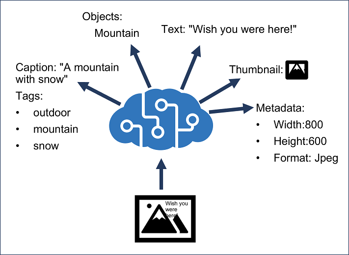
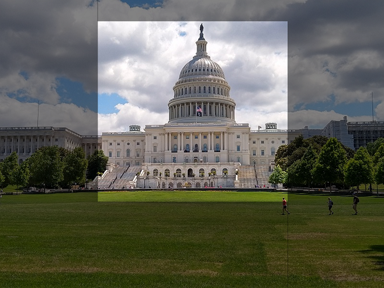

## Introduction

Azure AI Vision is a branch of artificial intelligence (AI) in which software interprets visual input, often from images or video feeds.

In this module, you'll learn how to use the Azure AI Vision service to extract information from images.

After completing this module, you’ll be able to:

Provision an Azure AI Vision resource.
Analyze an image.
Generate a smart cropped thumbnail.

## Provision an Azure AI Vision resource

The Azure AI Vision service is designed to help you extract information from images. It provides functionality that you can use for:

- Description and tag generation - determining an appropriate caption for an image, and identifying relevant "tags" that can be used as keywords to indicate its subject.
- Object detection - detecting the presence and location of specific objects within the image.
- People detection - detecting the presence, location, and features of people in the image.
- Image metadata, color, and type analysis - determining the format and size of an image, its dominant color palette, and whether it contains clip art.
- Category identification - identifying an appropriate categorization for the image, and if it contains any known landmarks.
- Background removal - detecting the background in an image and output the image with the background transparent or a greyscale - alpha matte image.
- Moderation rating - determine if the image includes any adult or violent content.
- Optical character recognition - reading text in the image.
- Smart thumbnail generation - identifying the main region of interest in the image to create a smaller "thumbnail" version.



You can provision Azure AI Vision as a single-service resource, or you can use the Azure AI Vision API in a multi-service Azure AI Services resource.

## Analyze an image

To analyze an image, you can use the Analyze Image REST method or the equivalent method in the SDK for your preferred programming language, specifying the visual features you want to include in the analysis (and if you select categories, whether or not to include details of celebrities or landmarks). This method returns a JSON document containing the requested information.

```python
import azure.ai.vision as vision

service_options = sdk.VisionServiceOptions(os.environ["VISION_ENDPOINT"],
                                           os.environ["VISION_KEY"])

image_source = sdk.VisionSource(url="<url>")

options = sdk.ImageAnalysisOptions()

options.features = (
    sdk.ImageAnalysisFeature.CAPTION |
    sdk.ImageAnalysisFeature.TEXT
)

options.language = "en"
options.gender_neutral_caption = True

image_analyzer = sdk.ImageAnalyzer(service_options, image_source, options)

result = image_analyzer.analyze()
```

You can also use scoped functions to retrieve specific subsets of the image features, including the image description, tags, and objects in the image.

The JSON response for image analysis looks similar to this example:

```json
{
  "categories": [
   {
     "name": "_outdoor_mountain",
     "confidence": "0.9"}
  ],
  "adult": {"isAdultContent": "false", …},
  "tags": [
    {"name": "outdoor", "confidence": 0.9},
    {"name": "mountain", " confidence ": 0.9}],
  "description": {
    "tags":["outdoor", "mountain"],
    "captions": [
      {"name": "A mountain with snow",
       "confidence": 0.9
      }
    ]
  },
  "metadata":
    {"width":60,"height":30, format:"Jpeg"},
  "faces": [],
  "brands": [],
  "color": {"dominantColorForeground": "Brown",…},
  "imageType": {"clipArtType": 0, …},
  "objects" : [
    {
     "rectangle": {x:20, y:25, w:10, h:20},
     "object": "mountain",
     "confidence": 0.9
    }
  ]
}
```

## Generate a smart-cropped thumbnail

Thumbnails are often used to provide smaller versions of images in applications and websites. For example, a tourism site might display a list of tourist attractions in a city with a small, representative thumbnail image for each attraction; and only display the full image when the user selects the "details" page for an individual attraction.

The Azure AI Vision service enables you to create a thumbnail with different dimensions (and aspect ratio) from the source image, and optionally to use image analysis to determine the region of interest in the image (its main subject) and make that the focus of the thumbnail. This ability to determine the region of interest is especially useful when cropping the image to change its aspect ratio.



## Analyze images with Azure AI Vision

This unit includes a lab to complete.
Use the free resources provided in the lab to complete the exercises in this unit. You will not be charged for the lab environment; however, you may need to bring your own subscription depending on the lab.
Microsoft provides this lab experience and related content for educational purposes. All presented information is owned by Microsoft and intended solely for learning about the covered products and services in this Microsoft Learn module.
