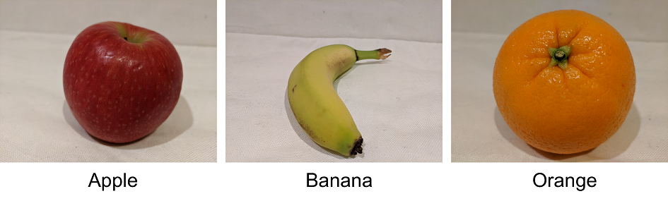

# Classify images

## Provision Azure resources for Azure AI Custom Vision

The Azure AI Custom Vision service enables you to build your own computer vision models for image classification or object detection.

Creating an Azure AI Custom Vision solution involves two tasks:

Use existing (labeled) images to train an Azure AI Custom Vision model.
Create a client application that submits new images to your model to generate predictions.
To use the Azure AI Custom Vision service, you must provision two kinds of Azure resource:

A training resource (used to train your models). This can be:
An Azure AI Services resource.
An Azure AI Custom Vision (Training) resource.
A prediction resource, used by client applications to get predictions from your model. This can be:
An Azure AI Services resource.
An Azure AI Custom Vision (Prediction) resource.
You can use a single Azure AI Services resource for both training and prediction, and you can mix-and-match resource types (for example, using an Azure AI Custom Vision (Training) resource to train a model that you then publish using an Azure AI Services resource).

## Understand image classification

Image classification is a computer vision technique in which a model is trained to predict a class label for an image based on its contents. Usually, the class label relates to the main subject of the image.

For example, the following images have been classified based on the type of fruit they contain

Models can be trained for multiclass classification (in other words, there are multiple classes, but each image can belong to only one class) or multilabel classification (in other words, an image might be associated with multiple labels).

## Train an image classifier

To train an image classification model with the Azure AI Custom Vision service, you can use the Azure AI Custom Vision portal, the Azure AI Custom Vision REST API or SDK, or a combination of both approaches.

In most cases, you'll typically use the Azure AI Custom Vision portal to train your model.
