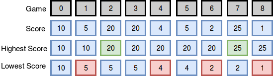

# Breaking the Records

Maria plays college basketball and wants to go pro. Each season she maintains a record of her play. She tabulates the number of times she breaks her season record for most points and least points in a game. Points scored in the first game establish her record for the season, and she begins counting from there.

**Example**

Scores are in the same order as the games played. She tabulates her results as follows:

                                     Count
    Game  Score  Minimum  Maximum   Min Max
     0      12     12       12       0   0
     1      24     12       24       0   1
     2      10     10       24       1   1
     3      24     10       24       1   1
Given the scores for a season, determine the number of times Maria breaks her records for most and least points scored during the season.

**Function Description**

Complete the breakingRecords function in the editor below.

breakingRecords has the following parameter(s):

int scores[n]: points scored per game

**Returns**

int[2]: An array with the numbers of times she broke her records. Index  is for breaking most points records, and index  is for breaking least points records.

**Constraints**

    1 <= n <= 1000
    0 <= score[i] <= 10^8


Sample Input 0

    9
    10 5 20 20 4 5 2 25 1
    Sample Output 0

    2 4
Explanation 0

The diagram below depicts the number of times Maria broke her best and worst records throughout the season:

image



She broke her best record twice (after games  and ) and her worst record four times (after games , , , and ), so we print 2 4 as our answer. Note that she did not break her record for best score during game , as her score during that game was not strictly greater than her best record at the time.


## Solution

```java
    public static List<Integer> breakingRecords(List<Integer> scores) {
    // Write your code here
        
        int mx = scores.get(0);
        int mn = scores.get(0);
        
        int cntMx = 0;
        int cntMn = 0;
        
        int n = scores.size();
         
        for(int i=1; i<n; i++) {
            int curr = scores.get(i);
            
            if(curr > mx) {
                // new max
                mx = curr;
                cntMx++;
            }
            
            if (curr < mn) {
                mn = curr;
                cntMn++;
            }
        }
        
        List<Integer> res = new ArrayList<>();
        res.add(cntMx);
        res.add(cntMn);
        return res;
    }
```