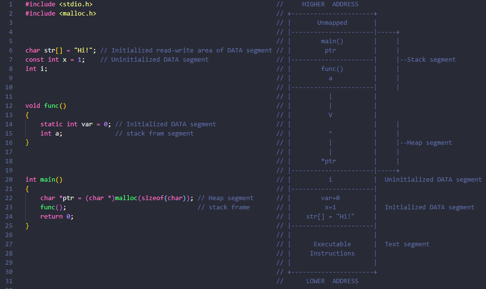

# Dynamic Memory Allocation

##  Memory Allocation
Static
- Memory allocated during compile time is called static memory.
- The memory allocated is fixed and cannot be increased and decreased during runtime.

**Problems with static memory allocation**

- If you are allocating memory for an array during compile time then you have to fix the size of the time of declaration. size is fixed and user cannot increase and decrease the size of the array at run-time.
- If the values stored by the user in the array at run time is less than the size specified then there will be wastage of memory.
- If the values stored by the user in the array at runt time is more than the size specified the program may crush or misbehave.

## Dynamic Memory Allocation

The process of allocating memory at the time of execution is called dynamic memory allocation.

Heap is the segment of memory where dynamic memory allocation takes place.

Unlike stack where memory is allocated or deallocated in a defined order. heap is an area of memory where memory is allocated or deallocated without any order or randomly.

- It is a way to allocate memory to a data structure during the runtime
- We need some function to allocate & free memory dynamically.

→ stdlib.h contains functions

**Functions for DMA**

1. malloc - memory allocation
2. calloc - continuous allocation
3. free - release memory
4. realloc - reallocation


**A. Malloc**

takes number of bytes to be allocated & returns a pointer to type void.

→ initialized with garbage values. 

```c
// ptr = (int *)malloc(5 * sizeof(int));

#include <stdio.h>
#include <stdlib.h>

int main(int argc, char const *argv[])
{
    int *ptr = (int*)malloc(4*sizeof(int)); 
    ptr[0] = 10;
    ptr[1] = 20;
    ptr[2] = 30;
    ptr[3] = 40;
    printf("%d\n", ptr[0]);
    printf("%d\n", ptr[1]);
    printf("%d\n", ptr[2]);
    printf("%d\n", ptr[3]);

    printf("%d\n", &ptr[0]);
    printf("%d\n", &ptr[1]);
    printf("%d\n", &ptr[2]);
    printf("%d\n", &ptr[3]);
 
    return 0;
}

// output
// 10
// 20
// 30
// 40
// 11604984
// 11604988
// 11604992
// 11604996

```

**B. Calloc**

→ Initialize with 0

```c
// int *ptr = (int*)calloc(4, sizeof(int));
// 4 - number of location

```

**C. Free**

We use it to free memory that is allocated using malloc & calloc

```c
// free(ptr);
```

**C. Realloc**

Reallocate (increase or decrease) memory using the same pointer & size.

```c
// syntax
// ptr = realloc(ptr, newSize);

#include <stdio.h>
#include <stdlib.h>

int main() {
    int *ptr = (int*)calloc(2,sizeof(int));
    ptr[0] = 12;
    ptr[1] = 14;

    printf("%d\n", ptr[0]);
    printf("%d\n", ptr[1]);
    ptr = (int *)relloc(4, sizeof(int));

    ptr[2] = 14;
    ptr[3] = 16;
    printf("%d\n", ptr[2]);
    printf("%d\n", ptr[3]); 

}
```

**How A C Program Stored In RAM Memory**




Stack: The stack is a region of memory used for storing local variables and function call information. Each time a function is called, a new stack frame is created to store parameters, local variables, and the return address. When the function completes, its stack frame is removed, and control returns to the calling function. The stack operates in a Last In, First Out (LIFO) manner and is managed automatically by the compiler and CPU.

Heap: The heap is a region of memory used for dynamic memory allocation. In C, memory can be dynamically allocated at runtime using functions like malloc(), calloc(), and realloc(). Memory allocated on the heap remains allocated until explicitly deallocated using free(). Unlike the stack, the heap's memory allocation is more flexible but also requires explicit management to avoid memory leaks and fragmentation.

Global and Static Variables: Global variables are variables declared outside of any function and have global scope, meaning they can be accessed from any part of the program. Static variables, when declared within a function, retain their value between function calls and have local scope but static lifetime. Both global and static variables are allocated in a separate region of memory typically called the data segment, which is distinct from the stack and heap.

Code Segment: The code segment, also known as the text segment, is a region of memory that stores the executable code of the program. This includes the compiled machine instructions of the program's functions and any constant values used by the program. The code segment is typically read-only and shared among multiple instances of the same program.

Constants and String Literals: Constants and string literals declared in the source code are typically stored in a read-only region of memory, often within the code segment. These values are immutable and cannot be modified during program execution.