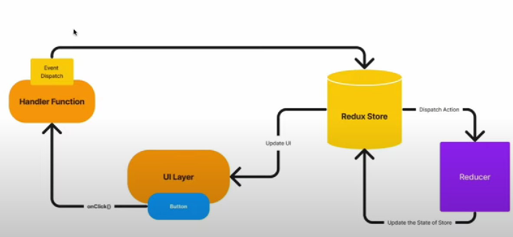

# REACTJS INTERVIEW QUESTIONS AND ANSWERS

---

**What is React.js?**

React is an open-source JavaScript library for building user interfaces. It's maintained by Facebook and a community of developers.

`What is JSX in React?`

JSX (JavaScript XML) is a syntax extension for JavaScript used in React to describe the structure of UI components. It looks similar to HTML but gets transpiled into JavaScript.

> It allows you to write javascript with html.

`What are components in React?`

Components are the building blocks of a React application. They are reusable, self-contained pieces of the user interface that can be composed to build complex UIs.

`What is the difference between functional components and class components in React?`

Functional components are simple JavaScript functions that accept props and return JSX. Class components are JavaScript classes that extend React.Component and have a render method.

`What is the purpose of props in React?`

Props (short for properties) are used for passing data from parent components to child components. They are read-only and help make components reusable.

`What is state in React?`

State is an object that represents the data a component needs to render. Unlike props, state is mutable and is used for managing component-specific data.

`What is the difference between state and props?`

State is mutable and managed by the component itself, while props are read-only and passed from a parent component.

`What is a React event handler?`

A React event handler is a function that is called when an event (e.g., a button click) occurs in a React component. Event handlers are typically defined in the component.

`What is the virtual DOM in React?`

The virtual DOM is a lightweight in-memory representation of the actual DOM. React uses it to optimize updates and improve performance by minimizing direct manipulation of the real DOM.

**Explain the component lifecycle methods in React.**

Components in React have lifecycle methods such as componentDidMount, componentDidUpdate, and componentWillUnmount that allow you to perform actions at various stages of a component's existence.

```js
// class based component
import React, { useState } from "react";
import "./App.css";

class Box extends React.Component {
  constructor(props) {
    super(props);
    this.state = {
      value: "", // Initialize the state property 'value'
    };
  }

  handleInput = (e) => {
    this.setState({ value: e.target.value });
  };

  componentDidUpdate() {
    console.log("component updated");
  }

  componentDidMount() {
    console.log("component is mounted");
  }

  componentWillUnmount() {
    console.log("component is unmounted");
  }

  render() {
    return (
      <div>
        <h2>A class Component 2</h2>
        <p>value {this.state.value}</p>
        <label htmlFor="name">Name</label>
        <input
          name="name"
          onChange={this.handleInput} // Use the arrow function to automatically bind 'this'
          type="text"
          placeholder="Enter name ..."
          value={this.state.value}
        />
      </div>
    );
  }
}

export default function App() {
  const [click, setClick] = useState(false);

  return (
    <div className="App">
      <h1>Hello CodeSandbox</h1>
      <button
        onClick={(e) => {
          setClick(!click);
        }}
      >
        Click
      </button>
      {click ? <Box /> : ""}
    </div>
  );
}

// functional component cycle

const Box = () => {
  const [value, setValue] = useState("");

  const handleInput = (e) => {
    setValue(e.target.value);
  };

  useEffect(() => {
    
    console.log("component is mounted");

    return () => {
      // clean up code
      console.log("component will unmount");
    };
  }, []);

  useEffect(() => {
    console.log("component updated");
    // You can perform additional logic here after each update if needed
  });

  return (
    <div>
      <h2>A Functional Component</h2>
      <p>value {value}</p>
      <label htmlFor="name">Name</label>
      <input
        name="name"
        onChange={handleInput}
        type="text"
        placeholder="Enter name ..."
        value={value}
      />
    </div>
  );
};
```

`What is React Router?`

React Router is a popular library for handling routing and navigation in React applications. It allows you to define routes and navigate between different parts of your app.

`What is the purpose of keys in React lists?`

Keys are used to uniquely identify elements in a list of components.
They help React efficiently update and re-render lists.

`Explain the concept of conditional rendering in React.`

Conditional rendering involves displaying different components or content based on specific conditions or user interactions. It's typically done using if statements or conditional operators in JSX.

`What is React Hooks?`

React Hooks are functions that allow you to use state and other React features in functional components. The most commonly used hooks are useState and useEffect.

`What are the advantages of using React for building user interfaces?`

React provides a component-based architecture for building reusable UI elements, offers a virtual DOM for performance optimization, and has a large and active community.

---

`Can you explain the difference between useState and useEffect in React?`

`Candidate:` "Certainly! useState and useEffect are two fundamental React Hooks that serve distinct roles in a React component.

`useState` is used for managing and updating the state of a component. It allows us to declare and initialize a state variable, and it returns an array with the current state value and a function to update that state. This is particularly useful for handling component-specific data like form input values, counters, and toggles. For example:

On the other hand, `useEffect` is designed for handling side effects within a React component. Side effects can include asynchronous operations like data fetching, DOM manipulation, and responding to state or prop changes.

In summary, `useState` is all about managing and updating the local state of a component, while `useEffect` is focused on handling side effects and executing actions that need to occur after the component has rendered.

---

**Vanilla JavaScript**

Without any (UI) framework and library.

ReactJS

ReactJS is a library used for building user interface. It was developed by Facebook in 2013.

**Why ReactJS?**

- React is extremely popular.
- It makes building complex, interactive UIs a breeze.
- It’s powerful and flexible.
- It has a very active and versatile ecosystem.
- Components, JSX & Props
  Core Features
- State
- Hooks (e.g., useEffect())
- Dynamic rendering

ReactJS
ReactJS is a library used for building user interface. It was developed by Facebook in 2013.

**Does react use HTML?**
No, it uses JSX which is like HTML.

**Drawback of ReactJS**

- In integrating react with MVC framework like rails require complex configuration.
- React requires the users have knowledge about the integration of user interface.

**What is JSX?**
JSX (Javascript XML) is an extension to javascript that allows you to write html-like syntax within Javascript code.

- It is used to describe the structure and appearance of react components.

Redux

- Redux is a predictable state container for JavaScript applications.
- Redux is a state management library for JavaScript applications, commonly used with react.

## React-Redux

React-Redux is a library that integrates react with redux.

## React-Toolkit (RTK)

• Redux Toolkit is the official set of tools recommended by the Redux team to simplify the process of writing Redux logic.

• Redux-Toolkit is an official package from the redux team that provides utilities to simplify the process of managing state in an redux application.
Important points

**Store**

• The store holds the global state of the application.

• Redux store is a state container that hol

• Redux can have only one store in our application.

• Whenever a store is created in an app, we need to specify the reducer.

**Action**

Actions are plain JavaScript objects that represent changes in our application state.

They are triggered by user interaction or other events.

**Reducers**

Reducers are pure functions that take the current state and action as argument and return new state.

# Redux Architecture

`Dispatch`
Dispatch is a function that allows you to dispatch an action to change a state in our application.

`Selector`
Selectors are functions that extract specific pieces of information from the redux store.

`Middleware`
Middleware in redux, provides a way to intercept and modify action before they reach the reducers.

`Redux Saga`
Redux Saga is a middleware library for handling side effects in redux application.
It allows you to manage asynchronous operations such as data fetching and handling external events, in a more organized and manageable way.



`Example`
Steps to create setup redux state management.

1. Create and configure store.
2. Create slice (every slice is a feature)
3. Add slices to the store.
4. Provide the Redux Store to React.
5. Use Redux State and Actions in React Components
6. npm install @reduxjs/toolkit react-redux

```js
// App/store.js

import { configureStore } from "@reduxjs/toolkit";

export const store = configureStore({
  reducer: {},
});

// index.js
import React from "react";
import ReactDOM from "react-dom";
import "./index.css";
import App from "./App";
import { store } from "./app/store";
import { Provider } from "react-redux";

ReactDOM.render(
  <Provider store={store}>
    <App />
  </Provider>,
  document.getElementById("root")
);
```

```js
// Create a Redux State Slice -> src/features/counter/counterSlice.js

import { createSlice } from "@reduxjs/toolkit";

const initialState = {
  value: 0,
};

export const counterSlice = createSlice({
  name: "counter",
  initialState,
  reducers: {
    increment: (state) => {
      // Redux Toolkit allows us to write "mutating" logic in reducers. It
      // doesn't actually mutate the state because it uses the Immer library,
      // which detects changes to a "draft state" and produces a brand new
      // immutable state based off those changes
      state.value += 1;
    },
    decrement: (state) => {
      state.value -= 1;
    },
    incrementByAmount: (state, action) => {
      state.value += action.payload;
    },
  },
});

// Action creators are generated for each case reducer function
export const { increment, decrement, incrementByAmount } = counterSlice.actions;

export default counterSlice.reducer;

// Add Slice Reducers to the Store -> app/store.js

import { configureStore } from "@reduxjs/toolkit";
import counterReducer from "../features/counter/counterSlice";
export const store = configureStore({
  reducer: {
    counter: counterReducer,
  },
});
```
