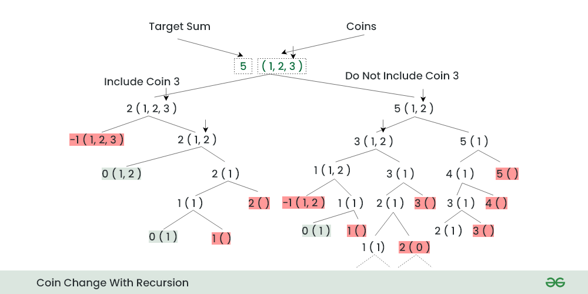

# Coin Change (ways)

Given an integer array of coins[ ] of size N representing different types of denominations and an integer sum, the task is to count the number of coins required to make a given value sum.

Note: Assume that you have an infinite supply of each type of coin.

```
Examples:

Input: sum = 4, coins[] = {1,2,3},
Output: 4
Explanation: there are four solutions: {1, 1, 1, 1}, {1, 1, 2}, {2, 2}, {1, 3}.
```

## Solution

### Recursion



**Time Complexity** - O(2^sum)
**Space Complexity** - O(sum)

```java

public class Main {
    static int fn(int coins[], int target, int i, int n) {
        if (i >= n) {
            return 0;
        }

        if (target == 0) {
            return 1;
        }

        if (target < 0) {
            return 0;
        }

        int take = fn(coins, target - coins[i], i, n);
        int notTake = fn(coins, target, i + 1, n);
        return take + notTake;
    }

    static int coinWays(int coins[], int sum) {
        return fn(coins, sum, 0, coins.length);
    }

    public static void main(String[] args) {
        int sum = 10;
        int coins[] = { 2, 5, 3, 6 };
        System.out.println(coinWays(coins, sum));
    }
}
```

### Dynamic Programming

```java

static int count(int[] coins, int sum, int n,
        int[][] dp) {

    if (sum == 0)
        return dp[n][sum] = 1;

    // If number of coins is 0 or sum is less than 0 then
    // there is no way to make the sum.
    if (n == 0 || sum < 0)
        return 0;

    // If the subproblem is previously calculated then
    // simply return the result
    if (dp[n][sum] != -1)
        return dp[n][sum];

    // Two options for the current coin
    return dp[n][sum] = count(coins, sum - coins[n - 1], n, dp)
            + count(coins, sum, n - 1, dp);
}

```
