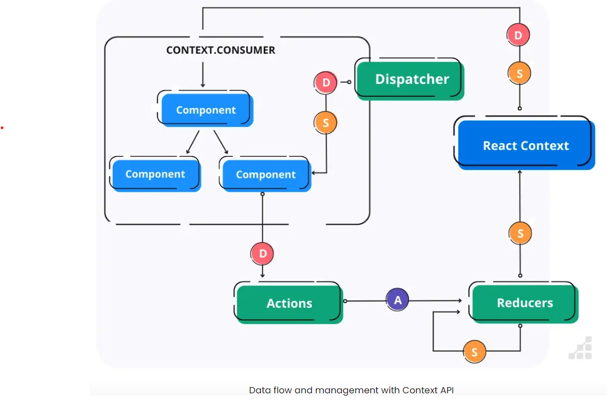
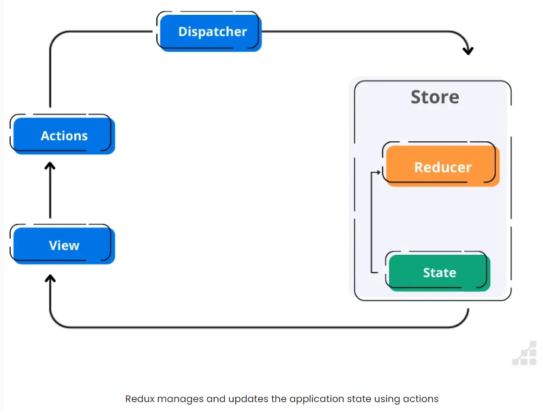

# State Management

State management is the most important factor of any web application, because state management defined how we can flow our data because all the component of our web application. (application is component based)

There are two way to manage state in react, that is

- Context-Switch API
- React-Redux Library

## Context-Switch API

Context-Switch Api a state management tool in react library that share state (data) globally


***API Architecture***



Steps to work with context-switch api

1. create context
2. create provider
   create shared state
3. use context

**First Method**

```js
import { createContext, useContext, useState } from "react";

// we can also create context on separate folder

// it can also initialized wit default values
export const authContext = createContext();

// same file or separate, work same, not bad, but separate recommanded
export const useAuthContext = () => {
  return useContext(authContext);
};

// provider
const AuthContextProvider = ({ children }) => {
  const [isLogin, setIsLogin] = useState(false);

  const logout = () => {
    setIsLogin(false);
  };

  const [username, setUsername] = useState("");

  return (
    <authContext.Provider value={{ isLogin, setIsLogin, username, logout }}>
      {children}
    </authContext.Provider>
  );
};

export default AuthContextProvider;

// using
import AuthContextProvider from "";

return (
  <AuthContextProvider>
    <SearchContextProvider>
      <App />
    </SearchContextProvider>
  </AuthContextProvider>
);
```

**Second Method**

```jsx
// DataContext.js
import React, { createContext, useReducer } from "react";

const initialState = {
  count: 0,
};

// context
const reducer = (state, action) => {
  switch (action.type) {
    case "INCREMENT":
      return { ...state, count: state.count + 1 };
    case "DECREMENT":
      return { ...state, count: state.count - 1 };
    case "RESET":
      return { ...state, count: 0 };
    default:
      return state;
  }
};

// context
const DataContext = createContext();

// provider
export const DataProvider = ({ children }) => {
  const [state, dispatch] = useReducer(reducer, initialState);

  return (
    <DataContext.Provider value={{ state, dispatch }}>
      {children}
    </DataContext.Provider>
  );
};

export default DataContext;
```

```jsx
// App.js
import React from "react";
import Counter from "./Counter";
import { DataProvider } from "./DataContext";

function App() {
  return (
    <DataProvider>
      <div>
        <h1>Counter App</h1>
        <Counter />
      </div>
    </DataProvider>
  );
}

export default App;
```

```jsx
// Counter.js
import React, { useContext } from "react";
import DataContext from "./DataContext";

function Counter() {
  const { state, dispatch } = useContext(DataContext);

  return (
    <div>
      <p>Count: {state.count}</p>
      <button onClick={() => dispatch({ type: "INCREMENT" })}>Increment</button>
      <button onClick={() => dispatch({ type: "DECREMENT" })}>Decrement</button>
      <button onClick={() => dispatch({ type: "RESET" })}>Reset</button>
    </div>
  );
}

export default Counter;
```

## Redux

- Redux is a statement management library for JS applications.
- `React-Redux` - react-redux is a react library that build on top of react.

### React-Toolkit (RTK)

- Redux Toolkit is the official set of tools recommended by the Redux team to simplify the process of writing Redux logic.

- Redux-Toolkit is an official package from the redux team that provides utilities to simplify the process of managing state in an redux application.

**Important points**

**Store**

- The store holds the global state of the application.
- Redux store is a state container that hol
- Redux can have only one store in our application.
- Whenever a store is created in an app, we need to specify the reducer.

**Action**

Actions are plain JavaScript objects that represent changes in our application state.

They are triggered by user interaction or other events.

**Reducers**

Reducers are pure functions that take the current state and action as argument and return new state.

```js
// state contains -> changed state
// action type
function reducerFnx(currState, action) {}
```


### Redux Architecture


# Redux Architecture

`Dispatch`
Dispatch is a function that allows you to dispatch an action to change a state in our application.

`Selector`
Selectors are functions that extract specific pieces of information from the redux store.

`Middleware`
Middleware in redux, provides a way to intercept and modify action before they reach the reducers.

`Redux Saga`
Redux Saga is a middleware library for handling side effects in redux application.
It allows you to manage asynchronous operations such as data fetching and handling external events, in a more organized and manageable way.



`Example`
Steps to create setup redux state management.

1. Create and configure store.
2. Create slice (every slice is a feature)
3. Add slices to the store.
4. Provide the Redux Store to React.
5. Use Redux State and Actions in React Components
6. npm install @reduxjs/toolkit react-redux

```js
// App/store.js

import { configureStore } from "@reduxjs/toolkit";

export const store = configureStore({
  reducer: {},
});

// index.js
import React from "react";
import ReactDOM from "react-dom";
import "./index.css";
import App from "./App";
import { store } from "./app/store";
import { Provider } from "react-redux";

ReactDOM.render(
  <Provider store={store}>
    <App />
  </Provider>,
  document.getElementById("root")
);
```

```js
// Create a Redux State Slice -> src/features/counter/counterSlice.js

import { createSlice } from "@reduxjs/toolkit";

const initialState = {
  value: 0,
};

export const counterSlice = createSlice({
  name: "counter",
  initialState,
  reducers: {
    increment: (state) => {
      // Redux Toolkit allows us to write "mutating" logic in reducers. It
      // doesn't actually mutate the state because it uses the Immer library,
      // which detects changes to a "draft state" and produces a brand new
      // immutable state based off those changes
      state.value += 1;
    },
    decrement: (state) => {
      state.value -= 1;
    },
    incrementByAmount: (state, action) => {
      state.value += action.payload;
    },
  },
});

// Action creators are generated for each case reducer function
export const { increment, decrement, incrementByAmount } = counterSlice.actions;

export default counterSlice.reducer;

// Add Slice Reducers to the Store -> app/store.js

import { configureStore } from "@reduxjs/toolkit";
import counterReducer from "../features/counter/counterSlice";
export const store = configureStore({
  reducer: {
    counter: counterReducer,
  },
});
```